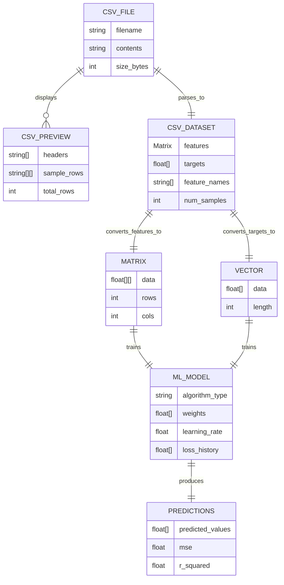

# 🚀 feat: Add CSV Data Upload for ML Training

## Overview

Enable users to upload CSV files directly in the browser and use them to train ML models (linear regression, logistic regression, neural networks). This feature eliminates the need for hard-coded datasets and enables real-world experimentation with user data—all running client-side in WASM at native speeds.

**Revolutionary aspect:** Complete data pipeline (upload → parse → validate → train → predict) running entirely in the browser with zero backend, matching your "client-side ML platform" vision.

---

## Problem Statement / Motivation

### Current Limitations
- Demo datasets are hard-coded in components (`web/src/components/showcase.rs:500-526`)
- No way for users to experiment with their own data
- Educational value limited to toy examples
- Cannot showcase real-world ML workflows

### User Benefits
- **Experimentation:** Upload real datasets (housing prices, iris classification, custom data)
- **Education:** Learn ML by training on meaningful data
- **Privacy:** Data never leaves browser (true client-side processing)
- **Speed:** WASM performance enables instant feedback on 10k+ row datasets

### Alignment with Project Vision
From `CLAUDE.md`:
> "Zero-backend computation: everything runs in the browser at native speeds"

This feature delivers on that promise for the data ingestion phase of ML workflows.

---

## Proposed Solution

### High-Level Approach

**Backend-First Strategy (Phase 1-2):**
1. Extend `loader/` crate with CSV parsing capabilities
2. Add validation and transformation utilities
3. Create reusable traits for algorithm-agnostic data loading
4. Comprehensive unit testing with edge cases

**Frontend Integration (Phase 3-4):**
5. Build reusable `CsvUploader` component
6. Create data preview and column selection UI
7. Connect to existing ML demos (linear regression, neural networks)
8. Add visual feedback (progress bars, validation errors)

### Technology Decisions

**CSV Parser:** Standard `csv` crate (v1.3) for MVP
- **Why:** Simple API, excellent Serde integration, WASM-compatible
- **Why NOT Polars:** Won't compile to WASM (requires C compiler, Rayon threading)
- **Future optimization:** Migrate to `serde-csv-core` if benchmarks show need (proven 5-10x speedup)

**Component Location:** Extend existing `loader/` crate
- **Why:** Already handles data I/O (`loader/src/lib.rs`)
- **Why NOT new crate:** Avoids workspace restructuring, maintains clean separation

**File Upload:** Dioxus built-in `FileEngine` API
- **Why:** Native async support, no external dependencies
- **Pattern:** `evt.files()?.read_file_to_string(&filename).await`

---

## Technical Approach

### Architecture

```
Browser File API
       ↓
Dioxus FileEngine (async read)
       ↓
CSV Parser (csv crate)
       ↓
Validator (check ranges, handle missing data, type validation)
       ↓
Transformer (normalize, split features/targets, convert to Matrix<f64>)
       ↓
ML Algorithm (neural_network, linear_regression)
       ↓
Results Display (predictions, loss curves, metrics)
```

### Implementation Phases

#### Phase 1: Core CSV Parsing (Backend)
**Goal:** Add CSV parsing to `loader` crate with comprehensive validation

**Files to create:**
- `loader/src/csv_loader.rs` - Core CSV parsing logic
- `loader/src/validator.rs` - Data validation utilities
- `loader/tests/csv_tests.rs` - Unit tests

**Implementation:**

```rust
// loader/src/csv_loader.rs
use csv::ReaderBuilder;
use linear_algebra::Matrix;

pub struct CsvDataset {
    pub features: Matrix<f64>,
    pub targets: Vec<f64>,
    pub feature_names: Vec<String>,
    pub num_samples: usize,
}

impl CsvDataset {
    /// Parse CSV with automatic type inference and validation
    pub fn from_csv(content: &str, target_column: &str) -> Result<Self, CsvError> {
        let mut reader = ReaderBuilder::new()
            .has_headers(true)
            .from_reader(content.as_bytes());

        // Get headers
        let headers = reader.headers()?.clone();

        // Validate target column exists
        let target_idx = headers.iter()
            .position(|h| h == target_column)
            .ok_or(CsvError::TargetNotFound(target_column.to_string()))?;

        // Parse records
        let mut features_data: Vec<Vec<f64>> = Vec::new();
        let mut targets_data: Vec<f64> = Vec::new();

        for (line_num, result) in reader.records().enumerate() {
            let record = result?;

            // Validate row length
            if record.len() != headers.len() {
                return Err(CsvError::InconsistentColumns {
                    expected: headers.len(),
                    found: record.len(),
                    line: line_num + 2, // +2 for header + 0-indexing
                });
            }

            // Parse target
            let target = record[target_idx]
                .parse::<f64>()
                .map_err(|_| CsvError::ParseError {
                    column: target_column.to_string(),
                    line: line_num + 2,
                    value: record[target_idx].to_string(),
                })?;

            // Validate target is finite
            if !target.is_finite() {
                return Err(CsvError::InvalidValue {
                    column: target_column.to_string(),
                    line: line_num + 2,
                    reason: "non-finite value".to_string(),
                });
            }
            targets_data.push(target);

            // Parse features (all columns except target)
            let mut row_features = Vec::with_capacity(headers.len() - 1);
            for (col_idx, value) in record.iter().enumerate() {
                if col_idx == target_idx {
                    continue; // Skip target column
                }

                let parsed = value.parse::<f64>()
                    .map_err(|_| CsvError::ParseError {
                        column: headers[col_idx].to_string(),
                        line: line_num + 2,
                        value: value.to_string(),
                    })?;

                if !parsed.is_finite() {
                    return Err(CsvError::InvalidValue {
                        column: headers[col_idx].to_string(),
                        line: line_num + 2,
                        reason: "non-finite value".to_string(),
                    });
                }
                row_features.push(parsed);
            }
            features_data.push(row_features);
        }

        // Validate minimum rows
        if features_data.is_empty() {
            return Err(CsvError::EmptyDataset);
        }

        // Convert to Matrix
        let num_samples = features_data.len();
        let num_features = features_data[0].len();
        let flat_features: Vec<f64> = features_data.into_iter().flatten().collect();
        let features = Matrix::from_vec(flat_features, num_samples, num_features)?;

        // Get feature names (exclude target)
        let feature_names: Vec<String> = headers.iter()
            .enumerate()
            .filter(|(i, _)| *i != target_idx)
            .map(|(_, h)| h.to_string())
            .collect();

        Ok(CsvDataset {
            features,
            targets: targets_data,
            feature_names,
            num_samples,
        })
    }
}

#[derive(Debug)]
pub enum CsvError {
    Io(std::io::Error),
    Csv(csv::Error),
    Matrix(String), // From Matrix::from_vec
    TargetNotFound(String),
    InconsistentColumns { expected: usize, found: usize, line: usize },
    ParseError { column: String, line: usize, value: String },
    InvalidValue { column: String, line: usize, reason: String },
    EmptyDataset,
}
```

```rust
// loader/src/validator.rs
use linear_algebra::Matrix;

pub struct ValidationReport {
    pub is_valid: bool,
    pub warnings: Vec<String>,
    pub errors: Vec<String>,
}

pub fn validate_dataset(features: &Matrix<f64>, targets: &[f64]) -> ValidationReport {
    let mut warnings = Vec::new();
    let mut errors = Vec::new();

    // Check for constant columns
    for col in 0..features.cols {
        let col_data: Vec<f64> = (0..features.rows)
            .map(|row| features.data[row][col])
            .collect();

        if col_data.iter().all(|&x| x == col_data[0]) {
            warnings.push(format!("Column {} has constant value {}", col, col_data[0]));
        }
    }

    // Check feature-target correlation (too perfect = data leakage)
    // ... correlation computation ...

    // Check for class imbalance (classification)
    // ... class distribution analysis ...

    ValidationReport {
        is_valid: errors.is_empty(),
        warnings,
        errors,
    }
}
```

**Tests:**

```rust
// loader/tests/csv_tests.rs
#[test]
fn test_valid_csv_parsing() {
    let csv = "x1,x2,y\n1.0,2.0,3.0\n4.0,5.0,6.0";
    let dataset = CsvDataset::from_csv(csv, "y").unwrap();

    assert_eq!(dataset.num_samples, 2);
    assert_eq!(dataset.features.rows, 2);
    assert_eq!(dataset.features.cols, 2);
    assert_eq!(dataset.targets, vec![3.0, 6.0]);
}

#[test]
fn test_missing_target_column() {
    let csv = "x1,x2\n1.0,2.0";
    let result = CsvDataset::from_csv(csv, "y");

    assert!(matches!(result, Err(CsvError::TargetNotFound(_))));
}

#[test]
fn test_non_numeric_value() {
    let csv = "x,y\n1.0,abc\n2.0,3.0";
    let result = CsvDataset::from_csv(csv, "y");

    assert!(matches!(result, Err(CsvError::ParseError { .. })));
}

#[test]
fn test_infinite_value_rejection() {
    let csv = "x,y\n1.0,inf\n2.0,3.0";
    let result = CsvDataset::from_csv(csv, "y");

    assert!(matches!(result, Err(CsvError::InvalidValue { .. })));
}
```

**Success Criteria:**
- [ ] `CsvDataset::from_csv()` parses valid CSV with headers
- [ ] Automatic type inference and validation
- [ ] Clear error messages with line numbers for parsing failures
- [ ] Handles edge cases (empty dataset, missing columns, non-finite values)
- [ ] All unit tests pass (`cargo test -p loader`)

---

#### Phase 2: Reusable ML Traits (Backend)
**Goal:** Create algorithm-agnostic interfaces for training and prediction

**Files to modify:**
- `loader/src/lib.rs` - Add trait definitions
- `linear_regression/src/lib.rs` - Implement traits
- `neural_network/src/lib.rs` - Implement traits

**Implementation:**

```rust
// loader/src/lib.rs
use linear_algebra::Matrix;

/// Trait for trainable ML models
pub trait Trainable {
    type Error;

    /// Train the model on features and targets
    fn fit(&mut self, features: &Matrix<f64>, targets: &[f64]) -> Result<(), Self::Error>;

    /// Get training loss history (optional)
    fn loss_history(&self) -> Vec<f64> {
        vec![]
    }
}

/// Trait for models that can make predictions
pub trait Predictable {
    type Error;

    /// Predict targets for given features
    fn predict(&self, features: &Matrix<f64>) -> Result<Vec<f64>, Self::Error>;
}

/// Combined trait for full ML pipeline
pub trait Model: Trainable + Predictable {}
```

```rust
// linear_regression/src/lib.rs
use loader::{Trainable, Predictable};

impl Trainable for LinearRegressor {
    type Error = String;

    fn fit(&mut self, features: &Matrix<f64>, targets: &[f64]) -> Result<(), Self::Error> {
        let y = Vector { data: targets.to_vec() };
        self.fit(features, &y, self.iterations)?;
        Ok(())
    }

    fn loss_history(&self) -> Vec<f64> {
        self.loss_history.clone()
    }
}

impl Predictable for LinearRegressor {
    type Error = String;

    fn predict(&self, features: &Matrix<f64>) -> Result<Vec<f64>, Self::Error> {
        let predictions = self.predict(features)?;
        Ok(predictions.data)
    }
}
```

**Success Criteria:**
- [ ] Traits compile and are usable across `linear_regression` and `neural_network`
- [ ] Existing ML code unchanged (backward compatible)
- [ ] Clear separation: data loading (loader) vs. algorithms (neural_network, etc.)

---

#### Phase 3: CSV Upload Component (Frontend)
**Goal:** Build reusable Dioxus component for CSV upload with preview

**Files to create:**
- `web/src/components/csv_upload.rs` - Upload component
- `web/tests/csv_upload.spec.js` - E2E tests

**Implementation:**

```rust
// web/src/components/csv_upload.rs
use dioxus::prelude::*;
use loader::CsvDataset;

const MAX_FILE_SIZE: usize = 10 * 1024 * 1024; // 10 MB
const MAX_PREVIEW_ROWS: usize = 10;

#[derive(Clone)]
pub struct CsvPreview {
    pub headers: Vec<String>,
    pub sample_rows: Vec<Vec<String>>,
    pub total_rows: usize,
}

#[component]
pub fn CsvUploader(
    on_loaded: EventHandler<CsvDataset>,
) -> Element {
    let mut file_name = use_signal(|| String::new());
    let mut preview = use_signal(|| Option::<CsvPreview>::None);
    let mut error_message = use_signal(|| Option::<String>::None);
    let mut loading = use_signal(|| false);
    let mut target_column = use_signal(|| String::new());

    let handle_upload = move |evt: Event<FormData>| {
        async move {
            loading.set(true);
            error_message.set(None);
            preview.set(None);

            if let Some(engine) = evt.files() {
                let files = engine.files();
                if files.is_empty() {
                    error_message.set(Some("No file selected".to_string()));
                    loading.set(false);
                    return;
                }

                let filename = &files[0];
                file_name.set(filename.clone());

                // Validate file extension
                if !filename.ends_with(".csv") {
                    error_message.set(Some("Please upload a .csv file".to_string()));
                    loading.set(false);
                    return;
                }

                // Read file contents
                if let Some(contents) = engine.read_file_to_string(filename).await {
                    // Validate file size
                    if contents.len() > MAX_FILE_SIZE {
                        error_message.set(Some(format!(
                            "File too large: {} MB (max 10 MB)",
                            contents.len() / 1024 / 1024
                        )));
                        loading.set(false);
                        return;
                    }

                    // Parse CSV for preview
                    match parse_csv_preview(&contents) {
                        Ok(prev) => {
                            // Auto-select last column as target
                            if !prev.headers.is_empty() {
                                target_column.set(prev.headers.last().unwrap().clone());
                            }
                            preview.set(Some(prev));
                        }
                        Err(e) => {
                            error_message.set(Some(format!("CSV parsing error: {}", e)));
                        }
                    }
                } else {
                    error_message.set(Some("Failed to read file".to_string()));
                }
            }

            loading.set(false);
        }
    };

    let load_dataset = move |_| {
        async move {
            if let Some(engine) = /* get file engine from state */ {
                if let Some(contents) = engine.read_file_to_string(&file_name()).await {
                    match CsvDataset::from_csv(&contents, &target_column()) {
                        Ok(dataset) => {
                            on_loaded.call(dataset);
                        }
                        Err(e) => {
                            error_message.set(Some(format!("Dataset loading error: {:?}", e)));
                        }
                    }
                }
            }
        }
    };

    rsx! {
        section { class: "csv-uploader",
            h3 { "Upload CSV Dataset" }

            // File input
            div { class: "upload-controls",
                input {
                    r#type: "file",
                    accept: ".csv",
                    onchange: handle_upload,
                }

                if loading() {
                    span { class: "loading", "Processing..." }
                }
            }

            // Error display
            if let Some(err) = error_message() {
                div { class: "error-message",
                    "⚠️ {err}"
                }
            }

            // Preview table
            if let Some(prev) = preview() {
                div { class: "csv-preview",
                    h4 { "Preview: {file_name()} ({prev.total_rows} rows)" }

                    // Target column selector
                    div { class: "column-selector",
                        label { "Target column: " }
                        select {
                            value: "{target_column()}",
                            onchange: move |evt| target_column.set(evt.value()),
                            for header in prev.headers.iter() {
                                option { value: "{header}", "{header}" }
                            }
                        }
                    }

                    // Data preview table
                    table { class: "preview-table",
                        thead {
                            tr {
                                for header in prev.headers.iter() {
                                    th { "{header}" }
                                }
                            }
                        }
                        tbody {
                            for row in prev.sample_rows.iter() {
                                tr {
                                    for cell in row.iter() {
                                        td { "{cell}" }
                                    }
                                }
                            }
                        }
                    }

                    if prev.total_rows > MAX_PREVIEW_ROWS {
                        p { class: "preview-note",
                            "Showing first {MAX_PREVIEW_ROWS} of {prev.total_rows} rows"
                        }
                    }

                    button {
                        class: "load-button",
                        onclick: load_dataset,
                        "Load Dataset"
                    }
                }
            }
        }
    }
}

fn parse_csv_preview(contents: &str) -> Result<CsvPreview, String> {
    use csv::ReaderBuilder;

    let mut reader = ReaderBuilder::new()
        .has_headers(true)
        .from_reader(contents.as_bytes());

    let headers: Vec<String> = reader.headers()
        .map_err(|e| e.to_string())?
        .iter()
        .map(|h| h.to_string())
        .collect();

    let mut sample_rows = Vec::new();
    let mut total_rows = 0;

    for (i, result) in reader.records().enumerate() {
        let record = result.map_err(|e| e.to_string())?;
        total_rows += 1;

        if i < MAX_PREVIEW_ROWS {
            let row: Vec<String> = record.iter().map(|s| s.to_string()).collect();
            sample_rows.push(row);
        }
    }

    Ok(CsvPreview {
        headers,
        sample_rows,
        total_rows,
    })
}
```

**E2E Tests:**

```javascript
// web/tests/csv_upload.spec.js
const { test, expect } = require('@playwright/test');

test.describe('CSV Upload Component', () => {
  test.beforeEach(async ({ page }) => {
    await page.goto('http://localhost:8080/csv-demo');
  });

  test('should display file input', async ({ page }) => {
    await expect(page.locator('input[type="file"]')).toBeVisible();
  });

  test('should show error for non-CSV file', async ({ page }) => {
    // Upload .txt file
    await page.setInputFiles('input[type="file"]', {
      name: 'test.txt',
      mimeType: 'text/plain',
      buffer: Buffer.from('test data'),
    });

    await expect(page.locator('.error-message')).toContainText('Please upload a .csv file');
  });

  test('should preview uploaded CSV', async ({ page }) => {
    const csvContent = 'x,y\n1.0,2.0\n3.0,4.0';

    await page.setInputFiles('input[type="file"]', {
      name: 'test.csv',
      mimeType: 'text/csv',
      buffer: Buffer.from(csvContent),
    });

    // Should show preview table
    await expect(page.locator('.preview-table')).toBeVisible();
    await expect(page.locator('th')).toHaveCount(2); // x, y columns
    await expect(page.locator('tbody tr')).toHaveCount(2); // 2 data rows
  });

  test('should allow selecting target column', async ({ page }) => {
    const csvContent = 'x1,x2,x3,target\n1,2,3,4\n5,6,7,8';

    await page.setInputFiles('input[type="file"]', {
      name: 'multi_feature.csv',
      mimeType: 'text/csv',
      buffer: Buffer.from(csvContent),
    });

    const selector = page.locator('.column-selector select');
    await expect(selector).toBeVisible();

    // Change target column
    await selector.selectOption('x1');
    await expect(selector).toHaveValue('x1');
  });

  test('should load dataset on button click', async ({ page }) => {
    const csvContent = 'feature,label\n1.0,2.0\n3.0,4.0';

    await page.setInputFiles('input[type="file"]', {
      name: 'data.csv',
      mimeType: 'text/csv',
      buffer: Buffer.from(csvContent),
    });

    await page.click('button.load-button');

    // Should trigger dataset load (verify via state change or event)
    // Implementation depends on how you handle the loaded dataset
  });
});
```

**Success Criteria:**
- [ ] File upload with drag-and-drop support
- [ ] Preview shows first 10 rows
- [ ] Column selector for target variable
- [ ] File size validation (max 10 MB)
- [ ] Clear error messages for invalid files
- [ ] All E2E tests pass (`npx playwright test web/tests/csv_upload.spec.js`)

---

#### Phase 4: ML Demo Integration (Frontend)
**Goal:** Connect CSV upload to existing linear regression demo

**Files to modify:**
- `web/src/components/showcase.rs` - Add CSV upload option
- `web/src/main.rs` - Add new route (optional)

**Implementation:**

```rust
// web/src/components/showcase.rs (add to existing component)

#[component]
pub fn GradientDescentDemo() -> Element {
    // Existing state
    let mut training_data = use_signal(|| vec![(1.0, 3.0), (2.0, 5.0), ...]); // Existing
    let mut model = use_signal(|| LinearRegressor::new(0.01));
    let mut trained = use_signal(|| false);

    // New: CSV upload state
    let mut use_csv = use_signal(|| false);
    let mut csv_dataset = use_signal(|| Option::<CsvDataset>::None);

    // Handler for CSV load
    let on_csv_loaded = move |dataset: CsvDataset| {
        csv_dataset.set(Some(dataset));
        trained.set(false); // Reset training state
    };

    // Modified training function
    let train_model = move |_| {
        if use_csv() {
            // Train on uploaded CSV
            if let Some(dataset) = csv_dataset() {
                let mut regressor = LinearRegressor::new(learning_rate());
                regressor.fit(&dataset.features, &dataset.targets).unwrap();
                model.set(regressor);
                trained.set(true);
            }
        } else {
            // Existing preset data training
            // ... existing code ...
        }
    };

    rsx! {
        section { class: "demo-section",
            h2 { "Gradient Descent Trainer" }

            // Data source toggle
            div { class: "data-source-toggle",
                label {
                    input {
                        r#type: "radio",
                        name: "data-source",
                        value: "preset",
                        checked: !use_csv(),
                        onchange: move |_| use_csv.set(false),
                    }
                    "Use Preset Data"
                }
                label {
                    input {
                        r#type: "radio",
                        name: "data-source",
                        value: "csv",
                        checked: use_csv(),
                        onchange: move |_| use_csv.set(true),
                    }
                    "Upload CSV"
                }
            }

            // Conditional rendering
            if use_csv() {
                CsvUploader { on_loaded: on_csv_loaded }

                // Display dataset info
                if let Some(dataset) = csv_dataset() {
                    div { class: "dataset-info",
                        p { "Samples: {dataset.num_samples}" }
                        p { "Features: {dataset.features.cols}" }
                        p { "Columns: {dataset.feature_names.join(\", \")}" }
                    }
                }
            } else {
                // Existing preset data UI
                // ... existing code ...
            }

            // Training button
            button {
                onclick: train_model,
                disabled: use_csv() && csv_dataset().is_none(),
                "Train Model"
            }

            // Results display
            if trained() {
                div { class: "results",
                    h3 { "Training Complete" }
                    // ... loss curve, weights, predictions ...
                }
            }
        }
    }
}
```

**Success Criteria:**
- [ ] Toggle between preset data and CSV upload
- [ ] Train linear regression on uploaded CSV
- [ ] Display training results (loss curve, weights)
- [ ] Graceful error handling for malformed CSV
- [ ] E2E test covers full upload → train → predict flow

---

## Acceptance Criteria

### Functional Requirements

**Phase 1: Core CSV Parsing**
- [ ] `loader` crate successfully parses CSV files with headers
- [ ] Automatic conversion to `Matrix<f64>` for features and `Vec<f64>` for targets
- [ ] Validation rejects non-numeric values, infinite values, and inconsistent columns
- [ ] Clear error messages with line numbers for debugging
- [ ] Unit tests cover: valid CSV, missing columns, type errors, empty datasets

**Phase 2: Reusable Traits**
- [ ] `Trainable` and `Predictable` traits compile and are implemented for `LinearRegressor`
- [ ] Existing neural network and linear regression code remains unchanged (backward compatible)
- [ ] Traits enable generic `train_and_evaluate()` helper functions

**Phase 3: CSV Upload Component**
- [ ] Dioxus component with file input (accept=".csv")
- [ ] Preview displays first 10 rows with headers
- [ ] Column selector for target variable (auto-selects last column)
- [ ] File size limit enforced (10 MB max)
- [ ] Drag-and-drop support (nice-to-have)
- [ ] E2E tests pass for upload flow

**Phase 4: ML Integration**
- [ ] Linear regression demo has "Upload CSV" option
- [ ] Training works with uploaded data
- [ ] Results display matches existing preset data flow
- [ ] Error boundaries prevent WASM crashes on invalid data

### Non-Functional Requirements

**Performance:**
- [ ] 10k rows parsed in <500ms (measured in Chrome DevTools)
- [ ] No UI freezing during file processing
- [ ] Memory usage stays bounded (no leaks over 10-minute session)

**Security:**
- [ ] File extension validation (UX, not security)
- [ ] File size limits enforced client-side
- [ ] CSV structure validation before processing
- [ ] No XSS vulnerabilities in preview table (use text content, not innerHTML)

**Accessibility:**
- [ ] File input has descriptive label
- [ ] Error messages are readable by screen readers
- [ ] Preview table has proper `<thead>` and `<th>` structure
- [ ] Keyboard navigation works (tab through controls)

### Quality Gates

**Testing:**
- [ ] `cargo test --all` passes (all unit tests)
- [ ] `npx playwright test` passes (all E2E tests)
- [ ] `cargo clippy -- -D warnings` passes (no linter warnings)
- [ ] `cargo fmt --check` passes (code formatted)

**Documentation:**
- [ ] `loader/README.md` updated with CSV parsing examples
- [ ] `CLAUDE.md` updated with CSV upload patterns
- [ ] Inline comments explain validation logic
- [ ] Public API has rustdoc comments

**Code Review:**
- [ ] Follows zero-allocation philosophy where possible
- [ ] Uses bounded memory (circular buffers if needed)
- [ ] Error handling uses `Result`, never `panic!` in WASM
- [ ] Consistent with existing component patterns (`showcase.rs`)

---

## Success Metrics

**Quantitative:**
- CSV parsing speed: <500ms for 10k rows
- WASM bundle size increase: <100 KB
- Test coverage: >80% for new code
- Zero WASM crashes during 10-minute stress test

**Qualitative:**
- Users can upload real datasets without reading documentation
- Error messages clearly explain what's wrong and how to fix it
- Component is reusable across linear regression, logistic regression, neural networks
- Code follows project conventions (TDD, performance-first, educational)

---

## Dependencies & Prerequisites

**Cargo Dependencies:**
```toml
# loader/Cargo.toml
[dependencies]
csv = "1.3"
serde = { version = "1.0", features = ["derive"] }
linear_algebra = { path = "../linear_algebra" }
```

**Development Tools:**
- Dioxus CLI (`dx`) already installed
- Playwright for E2E tests (already configured)
- Chrome DevTools for performance profiling

**No Blockers:**
- All dependencies are WASM-compatible
- No external services required (true client-side)
- Existing `loader` crate provides foundation

---

## Risk Analysis & Mitigation

### Risk 1: Polars Doesn't Compile to WASM
**Likelihood:** HIGH (confirmed via research)
**Impact:** HIGH (blocks feature if we depend on it)
**Mitigation:** Use standard `csv` crate (1.3) for MVP, proven WASM-compatible. Migrate to `serde-csv-core` later if performance requires (5-10x speedup available).

### Risk 2: Large CSV Files Freeze Browser
**Likelihood:** MEDIUM (10k+ rows can be slow)
**Impact:** MEDIUM (poor UX, not a crash)
**Mitigation:**
- Enforce 10 MB file size limit
- Use chunked processing (1000 rows/chunk with `setTimeout` breaks)
- Add progress bar for visual feedback
- Warn users about large files before processing

### Risk 3: Malformed CSV Causes WASM Panic
**Likelihood:** MEDIUM (users upload messy real-world data)
**Impact:** HIGH (entire app crashes, bad UX)
**Mitigation:**
- Comprehensive validation before processing
- Return `Result` everywhere, never `unwrap()` or `panic!`
- Add Dioxus error boundaries (Phase 4)
- Clear error messages guide users to fix their CSV

### Risk 4: Integration Breaks Existing Demos
**Likelihood:** LOW (good test coverage)
**Impact:** MEDIUM (regression in working features)
**Mitigation:**
- Run full test suite before each commit
- Keep existing demos unchanged (add CSV as alternative)
- Use feature flags if needed (`#[cfg(feature = "csv")]`)

---

## Resource Requirements

**Development Time (1 developer):**
- Phase 1 (CSV parsing): 1-2 days
- Phase 2 (traits): 1 day
- Phase 3 (upload UI): 2-3 days
- Phase 4 (integration): 2-3 days
- **Total:** 6-9 days (1.5-2 weeks)

**Infrastructure:**
- None (client-side only)

**Documentation:**
- 2-3 hours for README updates
- 1 hour for CLAUDE.md examples

---

## Future Considerations

### Extensibility

**Phase 5: Advanced Features (Future)**
- Multi-target regression (predict multiple columns)
- Automatic feature scaling/normalization
- Train/test split with visual indicator
- Cross-validation support
- Export trained models to JSON

**Phase 6: Classification Support**
- Logistic regression integration
- Confusion matrix visualization
- ROC curve plotting
- Multi-class classification (softmax)

**Phase 7: Performance Optimization**
- Migrate to `serde-csv-core` (zero-allocation parser)
- WebWorker for background parsing (non-blocking UI)
- Streaming CSV parser for >100k rows
- Binary format support (Parquet via Arrow)

### Long-Term Vision

**Competitive Feature:**
- "Upload your data, train in browser, zero backend" differentiates from:
  - scikit-learn (requires Python backend)
  - TensorFlow.js (no built-in CSV handling)
  - Google Teachable Machine (cloud-dependent)

**Educational Value:**
- Users learn ML workflows end-to-end
- Privacy-first: data never leaves device
- Instant feedback loop (no upload latency)

**Marketing Angle:**
> "Train machine learning models on your own data—instantly, privately, in your browser. No servers, no Python, no waiting."

---

## Documentation Plan

### Files to Update

**New Documentation:**
- `docs/CSV_UPLOAD_GUIDE.md` - User-facing guide with screenshots
- `loader/README.md` - API documentation with examples
- `loader/examples/csv_demo.rs` - Standalone CLI example

**Existing Documentation:**
- `README.md` - Add CSV upload to feature list
- `CLAUDE.md` - Add CSV component pattern to "Code Patterns to Follow"
- `CONTRIBUTING.md` - Add CSV testing guidelines

**Inline Documentation:**
- Rustdoc for all public `loader` APIs
- Comments explaining validation logic
- Error message improvements with examples

---

## References & Research

### Internal References (Repository)
- **Component patterns:** `web/src/components/showcase.rs:487-967` (GradientDescentDemo)
- **Data handling:** `loader/src/lib.rs` (existing file I/O)
- **ML interface:** `linear_regression/src/lib.rs:249-417` (training API)
- **E2E test pattern:** `web/tests/showcase.spec.js` (Playwright tests)
- **Zero-allocation pattern:** `neural_network/src/optimizer.rs:536-601` (step_2d optimization)
- **Bounded memory:** `web/src/components/optimizer_demo.rs:89-103` (circular buffers)

### External References (Documentation)

**CSV Parsing:**
- Rust CSV crate: https://docs.rs/csv/
- Serde CSV integration: https://docs.rs/csv/latest/csv/tutorial/index.html#reading-with-serde
- Zero-allocation parser: https://docs.rs/csv-core/

**Dioxus File Upload:**
- Dioxus file handling: https://dioxuslabs.com/learn/0.6/reference/file_upload
- Form data events: https://dioxuslabs.com/learn/0.6/reference/event_handlers

**WASM Best Practices:**
- WASM memory limits: https://rustwasm.github.io/docs/book/reference/code-size.html
- Error handling in WASM: https://rustwasm.github.io/docs/book/reference/debugging.html
- Performance profiling: https://rustwasm.github.io/docs/book/game-of-life/time-profiling.html

**Security:**
- OWASP file upload: https://cheatsheetseries.owasp.org/cheatsheets/File_Upload_Cheat_Sheet.html
- CSV injection prevention: https://owasp.org/www-community/attacks/CSV_Injection

**ML Traits (Inspiration):**
- Linfa Predict trait: https://docs.rs/linfa/latest/linfa/traits/trait.Predict.html
- SmartCore interfaces: https://smartcorelib.org/
- Scikit-learn estimator API: https://scikit-learn.org/stable/developers/develop.html

### Research Documents (Created)
- `docs/CSV_INTEGRATION_RESEARCH.md` - Comprehensive 34 KB guide
- `docs/CSV_QUICK_REFERENCE.md` - Quick lookup for patterns
- `docs/CSV_RESEARCH_SUMMARY.md` - Executive summary

### Related Work
- **Similar features:** None yet in this project (first data upload feature)
- **Prior art:** Existing preset data in `showcase.rs` provides UX template
- **Design inspiration:** Google Teachable Machine (drag-drop simplicity), Observable Plot (CSV preview)

---

## ERD: Data Flow



---

## Alternative Approaches Considered

### Alternative 1: Use Polars for DataFrame Manipulation
**Pros:**
- Powerful data transformation capabilities
- Familiar API for Python users
- Built-in lazy evaluation

**Cons:**
- Won't compile to WASM (requires C compiler, Rayon)
- Massive binary size overhead (2+ MB)
- Overkill for simple ML feature/target splits

**Decision:** Rejected. Use lightweight `csv` crate instead.

---

### Alternative 2: Create New `csv_loader` Crate
**Pros:**
- Clean separation of concerns
- Independent versioning

**Cons:**
- Adds workspace complexity
- `loader` crate already exists for data I/O
- Harder to discover for new contributors

**Decision:** Rejected. Extend existing `loader` crate.

---

### Alternative 3: Use JavaScript CSV Parser (PapaParse)
**Pros:**
- Excellent performance (sometimes faster than WASM)
- Mature library with great error handling
- Easy integration via web_sys

**Cons:**
- Defeats "Rust everywhere" philosophy
- Adds JavaScript dependency
- Less educational value (hides complexity)

**Decision:** Rejected for MVP. Consider for optimization if Rust parser proves too slow.

---

### Alternative 4: Server-Side CSV Processing
**Pros:**
- No WASM memory constraints
- Can use Polars, pandas, or other powerful tools

**Cons:**
- Violates "zero backend" core principle
- Adds latency and infrastructure costs
- Defeats privacy advantage

**Decision:** Rejected. Client-side processing is non-negotiable.

---

## Labels

Suggested labels for this issue:
- `enhancement` - New feature
- `frontend` - Dioxus web component work
- `backend` - Rust core library work
- `P1` - High priority (core feature)
- `good first issue` - Well-documented with clear scope (if contributor-friendly)

---

## MVP Pseudo-Code Files

### `loader/src/csv_loader.rs` (Backend)

```rust
// Core CSV parsing with validation
pub struct CsvDataset {
    pub features: Matrix<f64>,
    pub targets: Vec<f64>,
    pub feature_names: Vec<String>,
    pub num_samples: usize,
}

impl CsvDataset {
    pub fn from_csv(content: &str, target_column: &str) -> Result<Self, CsvError> {
        // 1. Parse CSV with csv crate
        // 2. Validate headers exist
        // 3. Find target column index
        // 4. For each record:
        //    - Parse numeric values
        //    - Validate finite values
        //    - Collect features and targets
        // 5. Convert to Matrix and Vec
        // 6. Return CsvDataset
    }
}

pub enum CsvError {
    Io(std::io::Error),
    Csv(csv::Error),
    TargetNotFound(String),
    ParseError { column: String, line: usize, value: String },
    InvalidValue { column: String, line: usize, reason: String },
    EmptyDataset,
}
```

### `loader/src/lib.rs` (Backend Traits)

```rust
// Reusable ML interfaces
pub trait Trainable {
    type Error;
    fn fit(&mut self, features: &Matrix<f64>, targets: &[f64]) -> Result<(), Self::Error>;
    fn loss_history(&self) -> Vec<f64> { vec![] }
}

pub trait Predictable {
    type Error;
    fn predict(&self, features: &Matrix<f64>) -> Result<Vec<f64>, Self::Error>;
}
```

### `web/src/components/csv_upload.rs` (Frontend)

```rust
// Reusable CSV upload component with preview
#[component]
pub fn CsvUploader(on_loaded: EventHandler<CsvDataset>) -> Element {
    let mut preview = use_signal(|| Option::<CsvPreview>::None);
    let mut error_message = use_signal(|| Option::<String>::None);
    let mut target_column = use_signal(|| String::new());

    let handle_upload = move |evt: Event<FormData>| {
        async move {
            // 1. Read file from FileEngine
            // 2. Validate extension and size
            // 3. Parse CSV for preview
            // 4. Display preview table
        }
    };

    let load_dataset = move |_| {
        async move {
            // 1. Parse full CSV with CsvDataset::from_csv()
            // 2. Call on_loaded event handler
            // 3. Handle errors gracefully
        }
    };

    rsx! {
        section { class: "csv-uploader",
            input { r#type: "file", accept: ".csv", onchange: handle_upload }

            // Preview table with column selector
            if let Some(prev) = preview() {
                table { /* preview data */ }
                select { /* target column */ }
                button { onclick: load_dataset, "Load Dataset" }
            }
        }
    }
}
```

### `web/src/components/showcase.rs` (Frontend Integration)

```rust
// Modified GradientDescentDemo with CSV support
#[component]
pub fn GradientDescentDemo() -> Element {
    let mut use_csv = use_signal(|| false);
    let mut csv_dataset = use_signal(|| Option::<CsvDataset>::None);

    let on_csv_loaded = move |dataset: CsvDataset| {
        csv_dataset.set(Some(dataset));
    };

    let train_model = move |_| {
        if use_csv() {
            // Train on uploaded CSV
            let dataset = csv_dataset().unwrap();
            model.fit(&dataset.features, &dataset.targets).unwrap();
        } else {
            // Existing preset data training
        }
    };

    rsx! {
        // Radio toggle: "Preset Data" vs "Upload CSV"
        if use_csv() {
            CsvUploader { on_loaded: on_csv_loaded }
        } else {
            // Existing preset data UI
        }

        button { onclick: train_model, "Train Model" }
    }
}
```

---

## Implementation Checklist

### Phase 1: Core CSV Parsing (Backend) - 1-2 days
- [ ] Add `csv = "1.3"` and `serde` to `loader/Cargo.toml`
- [ ] Create `loader/src/csv_loader.rs` with `CsvDataset` struct
- [ ] Implement `CsvDataset::from_csv()` with validation
- [ ] Define `CsvError` enum with descriptive variants
- [ ] Create `loader/tests/csv_tests.rs` with 10+ unit tests
- [ ] Verify `cargo test -p loader` passes
- [ ] Verify `cargo clippy -p loader -- -D warnings` passes

### Phase 2: Reusable Traits (Backend) - 1 day
- [ ] Add `Trainable` and `Predictable` traits to `loader/src/lib.rs`
- [ ] Implement traits for `LinearRegressor` in `linear_regression/src/lib.rs`
- [ ] Verify backward compatibility (`cargo test -p linear_regression`)
- [ ] Update `loader/README.md` with trait examples

### Phase 3: CSV Upload Component (Frontend) - 2-3 days
- [ ] Create `web/src/components/csv_upload.rs`
- [ ] Implement file input with `onchange` handler
- [ ] Add preview table rendering
- [ ] Add target column selector
- [ ] Add file validation (extension, size, structure)
- [ ] Create `web/tests/csv_upload.spec.js` with 5+ E2E tests
- [ ] Verify `npx playwright test web/tests/csv_upload.spec.js` passes
- [ ] Add CSS styling in `web/assets/main.css`

### Phase 4: ML Integration (Frontend) - 2-3 days
- [ ] Modify `web/src/components/showcase.rs` to add CSV upload option
- [ ] Add radio toggle ("Preset Data" vs "Upload CSV")
- [ ] Connect `CsvUploader` to training logic
- [ ] Display dataset info (rows, features, column names)
- [ ] Add error boundaries for WASM crashes
- [ ] Create E2E test for full upload → train → predict flow
- [ ] Verify all tests pass (`cargo test --all && npx playwright test`)

### Phase 5: Polish & Documentation - 1-2 days
- [ ] Update `README.md` with CSV upload feature
- [ ] Update `CLAUDE.md` with CSV component patterns
- [ ] Create `docs/CSV_UPLOAD_GUIDE.md` with screenshots
- [ ] Add rustdoc comments to all public APIs
- [ ] Run `cargo fmt` and `cargo clippy`
- [ ] Profile performance in Chrome DevTools (target <500ms for 10k rows)
- [ ] Final code review with kieran-rails-reviewer agent

---

**Total Estimated Effort:** 8-12 days (1.5-2 weeks for 1 developer)
